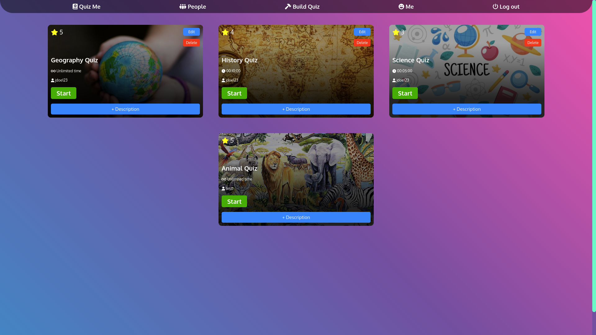

The main purpose of this project was to practice Rails APIs with React. And to create a logical quiz application using those tools.

Visit this project live at: https://app-quiz-me.herokuapp.com/#/

OR

Run the project locally (prerequisites: ruby 3.0.0, rails 6.0.3.2):

1. Download or clone the repository.
2. Open the terminal inside the root of the project and run:
3. bundle install
4. rails db:create
5. rails db:migrate
6. rails db:seed
7. rails s
8. In your internet browser visit localhost:3000
